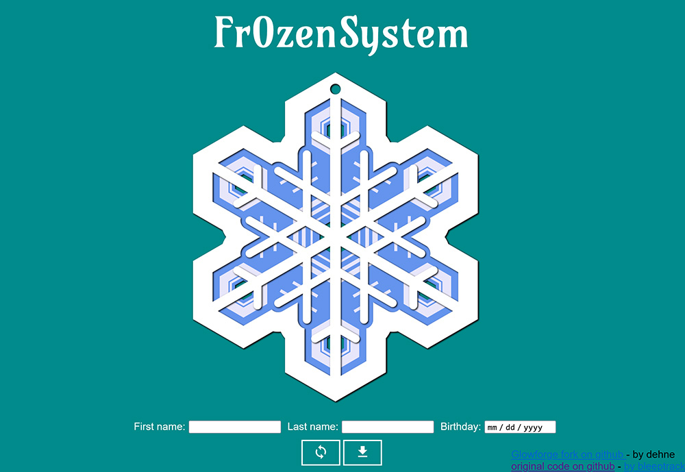
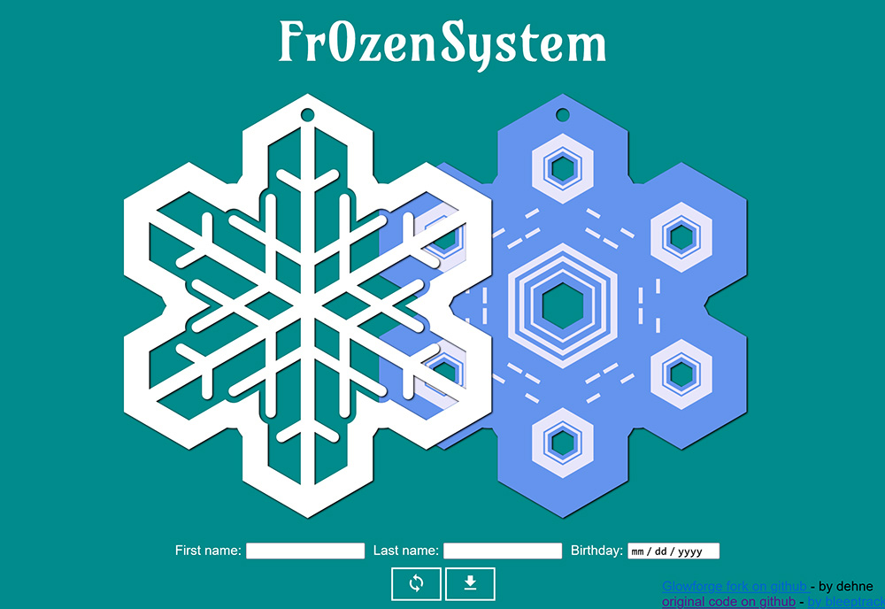
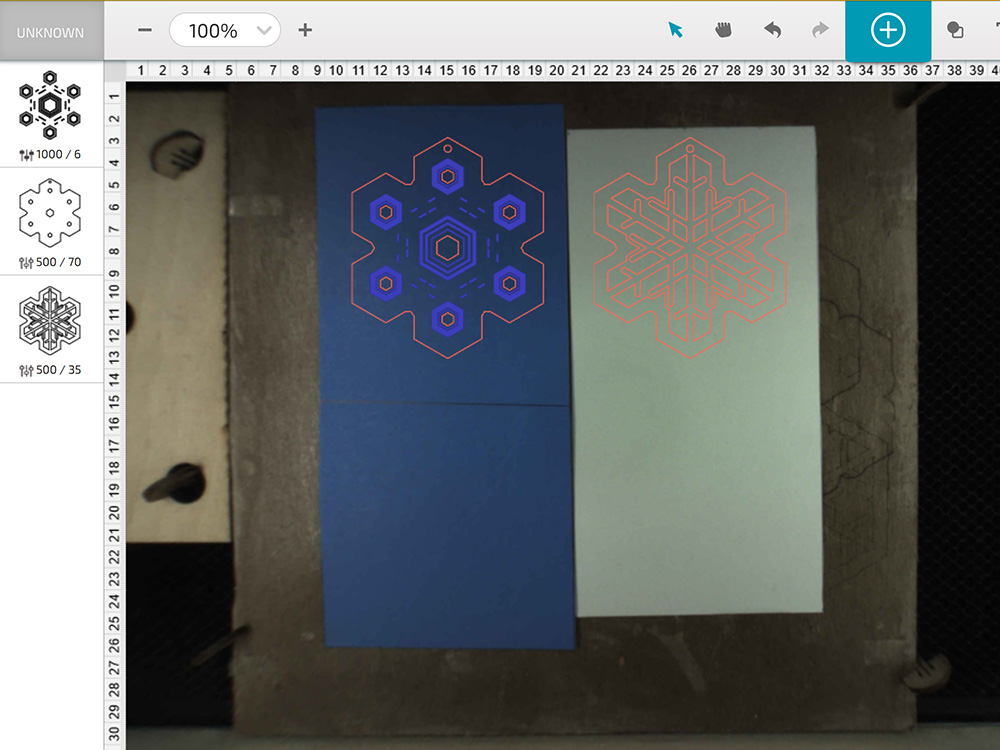
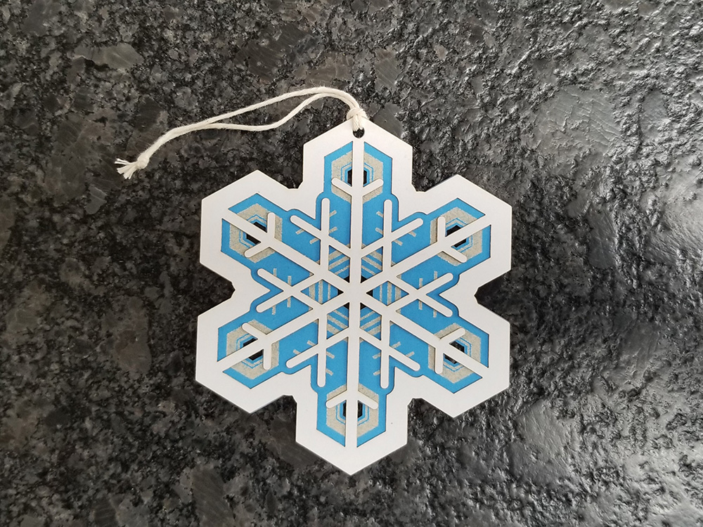

# Fr0zenSystem – Glowforge Edition V1.0.0

## About the system

Fr0zenSystem is a little snowflake generator. It can generate any number of nice two-layer snowflake shapes. These can then be laser cut and stacked together. The top layer is only cut. The bottom, intended to be cut from something like colored poster board layer or translucent vellum paper, is both engraved and cut.

It's also possible to make three-layer, two-sided snowflakes by cutting two of the top layer and putting one on each side of the engraved layer. If you use translucent material for the central layer, you'll only need to engrave it on one side. If you use opaque material like poster board, you'll need to engrave both sides.

This version of Fr0zenSystem is a fork of the original project by [bleeptrack](https://twitter.com/Bleeptrack). (See [here](https://github.com/bleeptrack/fr0zen-system-laser).) It has been altered to make the output SVG files directly usable with the Glowforge laser cutter. It has also been extended to generate a specific unique snowflake for any specified name and birthday. If no name or birthday is supplied, it generates a new snowflake each time the "regenerate" button is pressed. Finally, while leaving the essentials of the snowflake generating algorithm unchanged, the code has been pretty extensively reworked and documented. (Yes, I'm a coder. What can I say?)

As was true of the original Fr0zenSystem, this version is probably useful for other laser cutters as well as pen- or cutter plotters.

## How to Use the System

When you go to the system's page you'll see the image of a generated snowflake:

If you click on the snowflake, the image will unstack the two layers so you can see the back layer more easily:

Clicking on the regenerate button will make a new random snowflake. You can also enter someone's name and birthday and click on the regenerate button to create the unique snowflake that corresponds to what you entered. To go back to generating random snowflakes, clear out the names and birthdate.

When you have the snowflake you'd like to cut, click on the download button. This will bring up a dialog that lets you save the current snowflake as a Glowforge-compatible .svg file. Next, upload it in the usual way to the Glowforge GFUI. In the GFUI, select everything and use the scaling tools to make the flake the size you want. Next position the two layers over your material and set the parameters you'll use for each step. I like to place both kinds of materials next to each other on a slightly sticky backing board. When everything's ready to go, it looks like this:

Here I'm using blue poster board for the back layer and white cardstock for the front. The operation settings will vary depending on your material, of course, and on where you like the balance between speed and power. As has been widely discussed, faster with more power often results in less char than slower with less power. But going fast around sharp corners can lead to cuts with wobbles in them.

As always, laser cutting thin material works best if it is first stuck to a flat, smooth backing of some sort, so the air assist doesn't get under it. I use a piece of waste pasteboard covered with laser-compatible contact cement that allows material to be repositioned. I've successfully used both 3M spray adhesive and rubber cement but like the 3M coating better because it stays tacky for a long time and is just sticky enough to hold things in place during cutting but not so sticky as to make removing the cut pieces hard. I use a craft knife to get under the edge of the pieces to be removed.

## Original Photos and Video

[Cutting Process](img/laser.jpg)

[First half](img/blackwhite.jpg)

[Finished Snowflakes](img/finished.jpg)

[WiP Video](https://youtu.be/-WHORPKPZP4)

## License
[Blue Model Oak License 1.0.0](https://blueoakcouncil.org/license/1.0.0)